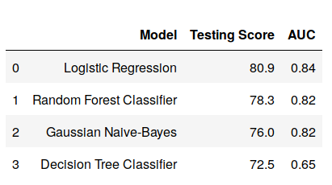

<h1 align="center"> Customer Churn Analysis using Machine Learning Techniques </h1>

Kushal Borkar 7th Oct, 2019

## Motivation

For all companies that bill customers on a regular basis, one of the main variables is churning. So, __INSAID__ provided me with the oppurtunity to applying ML techniques to predicting customer. I have to see if I could identify the key reasons behind customer churn & if possible, create a model that would help retain the same customers.

### Python Libraries
- pandas
- numpy
- seaborn
- matplotlib
- sklearn

## Methodology

The dataset consists of 21 variables in all. A few are continuous, rest are categorical. The control variable was customer churn with 2 levels Y/N (i.e. customer has left or not). The variables are as follows:

1.	__CustomerID__: 	The unique ID of each customer
2.	__Gender__: 	The gender of a person
3.	__SeniorCitizen__:	Whether a customer can be classified as a senior citizen.
4.	__Partner__: 	If a customer is married/ in a live-in relationship.
5.	__Dependents__:	If a customer has dependents (children/ retired parents)
6.	__Tenure__:	The time for which a customer has been using the service.
7.	__PhoneService__:  	Whether a customer has a landline phone service along with the internet service.
8.	__MultipleLines__:	Whether a customer has multiple lines of internet connectivity.
9.	__InternetService__: 	The type of internet services chosen by the customer.
10.	__OnlineSecurity__: 	Specifies if a customer has online security.
11.	__OnlineBackup__: 	Specifies if a customer has online backup.
12.	__DeviceProtection__: 	Specifies if a customer has opted for device protection.
13.	__TechSupport__: 	Whether a customer has opted for tech support of not.
14.	__StreamingTV__:	Whether a customer has an option of TV streaming.
15.	__StreamingMovies__: 	Whether a customer has an option of Movie streaming.
16.	__Contract__:  	The type of contract a customer has chosen.
17.	__PaperlessBilling__:  	Whether a customer has opted for paperless billing.
18.	__PaymentMethod__: 	Specifies the method by which bills are paid.
19.	__MonthlyCharges__: 	Specifies the money paid by a customer each month.
20.	__TotalCharges__: 	The total money paid by the customer to the company.
21.	__Churn__:  	This is the target variable which specifies if a customer has churned or not.

- ___Initially, we started out with some basic EDA & some visual plots that would help us understand the data better.___

- ___Since many machine learning algorithms cannot operate on categorical variables, we had to convert this data into numerical variables. We decided to use the Label Encoder method to convert the variable type.___

- ___In addition, we proceeded to use techniques like Feature Importance & Feature Selection to see if we had any variables that were redundant & could be discarded in the process of building the models.___

- ___Consequently, decided to use models like Logistic Regression, Random Forest, Decision Trees & Naïve-Bayes Classifier for this analysis.___

- ___We split the data into train & test & built a model using each of these classifiers.___

- ___We also plotted the ROC curves to check the performance of the binary classifiers.___

## Results

- _We also plotted the ROC curve for all the classifiers as a diagnostic test to evaluate the performance of the models. Another fancy way to check at model accuracy is to look at the model precision, recall & fscore or basically, a Confusion Matrix._

- _As we can see, the model with the best ROC curve is the Logistic Regression. Naïve Bayes & Random Forest are competing for the second place._

- _Our observations from the AUC concur with the test data scores across all the models, as shown below._

## Final Conclusions & Remarks

- It is intriguing to have more features, some continuous ones in our model. This would presumably increase the proficiency of our models.

- We went over a few articles that referenced that Decision Trees handle categorical variables better than continuous variables. That didn't appear to be the situation in our models.

- In view of the model scores, to predict customer churn Logistic Regression is by all accounts the best model for this dataset.
